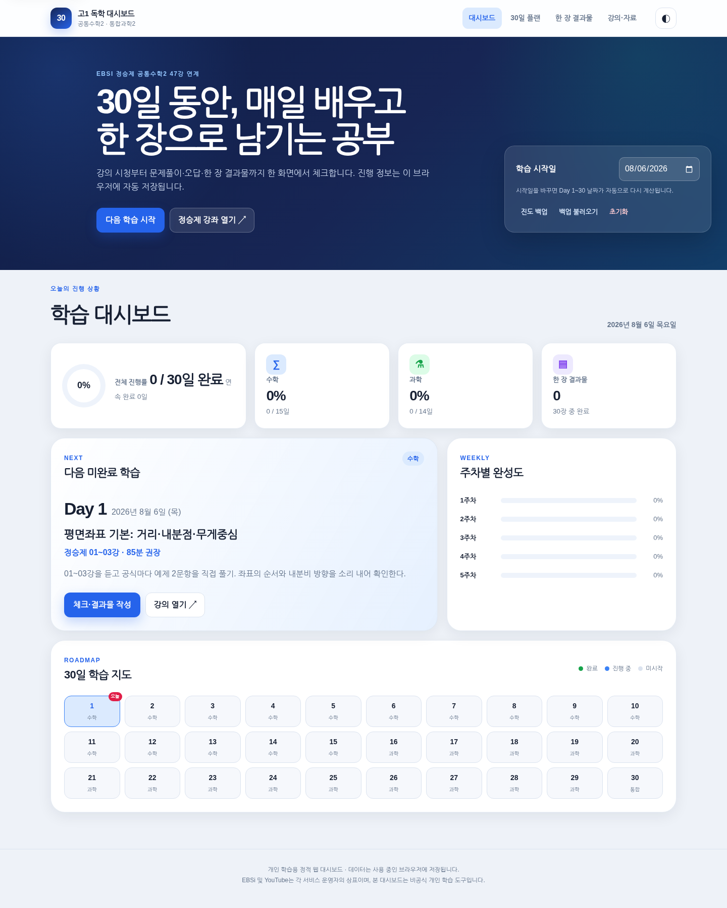

# 고1 공통수학2 · 통합과학2 30일 독학 대시보드

GitHub Pages에 그대로 올릴 수 있는 **정적 HTML/CSS/JavaScript 학습 대시보드**입니다. 별도 서버나 데이터베이스가 필요하지 않습니다.



- 수학 Day 1~15: EBSi 정승제 선생님의 **[매쓰 디렉터의 고1 수학 개념 끝장내기] 공통수학2 (2022 개정)** 총 47강을 15일로 배치
- 과학 Day 16~29: 통합과학2 핵심 단원별 영상·학습 미션
- Day 30: 수학·과학 오답/개념 포트폴리오
- 매일 `강의 시청 → 개념노트 → 문제풀이 → 오답정리 → 한 장 결과물` 체크
- 시작일 변경, 자동 날짜 계산, 과목·주차별 진행률, 다음 미완료 Day 안내
- 한 장 결과물 입력·인쇄/PDF, 이미지/PDF 첨부
- 진도 JSON 백업·복원, 다크 모드, 모바일 화면, 오프라인 캐시

## 바로 실행하기

파일을 내려받은 뒤 `index.html`을 열어도 기본 기능을 사용할 수 있습니다. 첨부 파일 저장과 오프라인 기능까지 안정적으로 사용하려면 로컬 서버 또는 GitHub Pages에서 실행하는 편이 좋습니다.

```bash
python -m http.server 8000
```

브라우저에서 `http://localhost:8000`을 엽니다.

## GitHub Pages에 올리는 방법

### 방법 1. 저장소 루트에서 바로 배포

1. GitHub에서 새 저장소를 만듭니다.
2. 이 폴더 안의 파일을 저장소 최상위에 업로드합니다.
3. 저장소의 **Settings → Pages**로 이동합니다.
4. **Build and deployment → Source**를 `Deploy from a branch`로 선택합니다.
5. Branch는 `main`, 폴더는 `/(root)`를 선택하고 저장합니다.
6. 잠시 후 Pages 주소에서 대시보드가 열립니다.

모든 경로가 상대경로로 작성되어 있어 `https://사용자명.github.io/저장소명/` 형태에서도 동작합니다.

## 데이터 저장 방식

- 체크 상태와 작성 내용: 브라우저 `localStorage`
- 이미지/PDF 첨부: 브라우저 `IndexedDB`
- 서버로 전송되는 데이터는 없습니다.
- 브라우저 데이터 삭제, 시크릿 모드 종료, 기기 변경 시 기록이 사라질 수 있으므로 상단의 **진도 백업**을 주기적으로 사용하세요.
- JSON 백업에는 첨부 파일 자체가 포함되지 않습니다. 중요한 결과물 원본은 별도 폴더에도 보관하세요.

## 파일 구성

```text
.
├── index.html             # 화면 구조
├── styles.css             # 반응형 디자인·다크 모드
├── data.js                # 30일 플랜·47강 목차·자료 링크
├── app.js                 # 진행률·저장·한 장 결과물·백업 기능
├── manifest.webmanifest   # 홈 화면 설치 정보
├── sw.js                  # 오프라인 캐시
├── favicon.svg
├── assets/
│   ├── preview.png
│   └── preview-mobile.png
├── .nojekyll
└── README.md
```

## 강의 기준 자료

- EBSi 정승제 공통수학2 공식 강좌  
  https://www.ebsi.co.kr/ebs/lms/lmsx/retrieveSbjtDtl.ebs?courseId=S20240001005
- EBS 매쓰 디렉터 공통수학2 공식 교재  
  https://www.ebsi.co.kr/ebs/pot/potg/retrieveCourseDetailNw.ebs?bookId=LB00000005678
- EBSi YouTube 첫 수업 맛보기  
  https://www.youtube.com/watch?v=bLH_Cku2cng

## 수정 포인트

- 학습 계획·영상 링크: `data.js`의 `STUDY_PLAN`
- 정승제 강의 목차: `data.js`의 `MATH_LECTURES`
- 색상·레이아웃: `styles.css` 상단의 `:root`
- 저장 키 또는 기능: `app.js`

## 주의

EBSi와 YouTube의 콘텐츠는 각 운영자의 저작물입니다. 이 저장소에는 강의 영상을 복제하거나 포함하지 않고 공식/외부 페이지 링크만 제공합니다. 본 대시보드는 개인 학습 관리를 위한 비공식 도구입니다.
